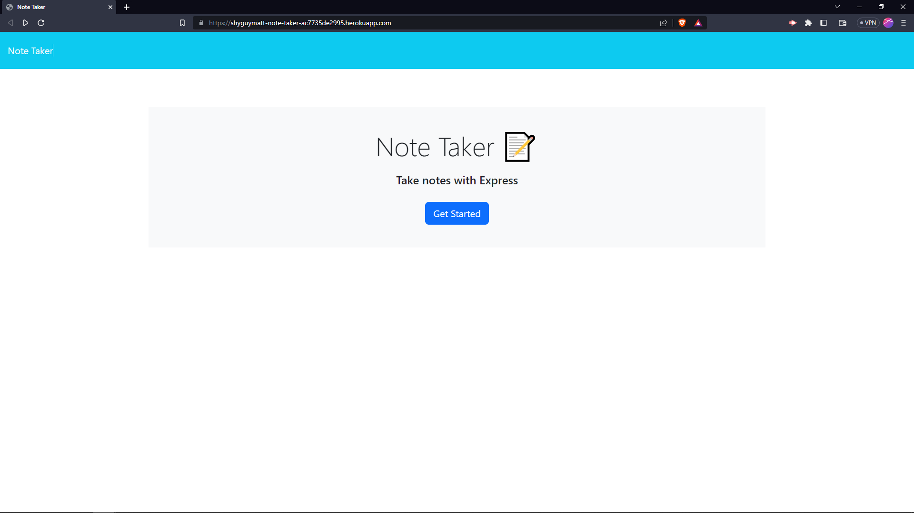
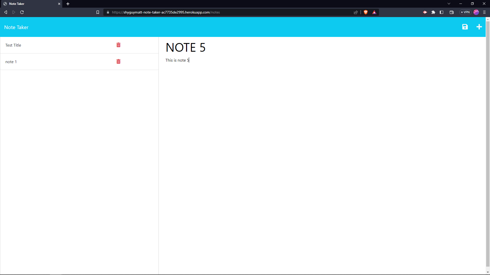
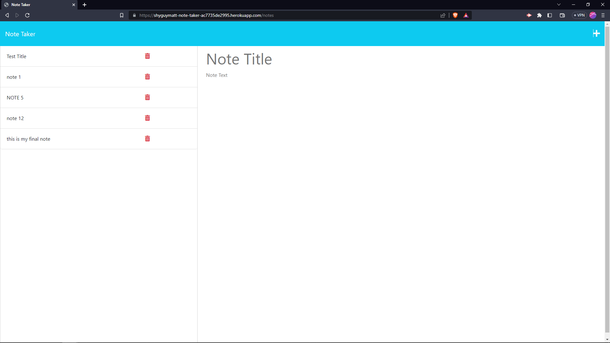

# Note taker app
## Requirements
write a backend app that connects with the prebuilt frontend to add functionality.

there should be routes for the homepage "/",
routes for the notes page "notes",
and api routes to send and recieve data.

## Screenshots

## Links
https://github.com/shyguyMatt/Note-Taker
https://shyguymatt-note-taker-ac7735de2995.herokuapp.com/
